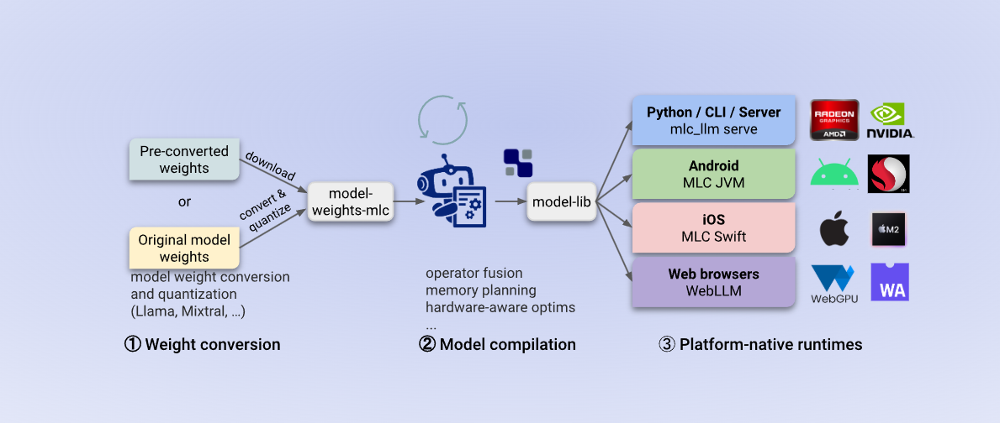
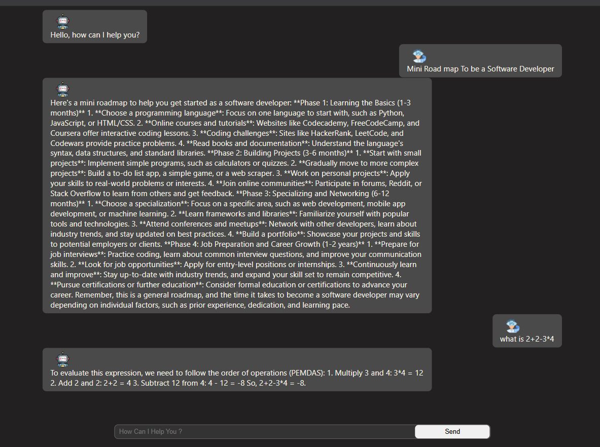
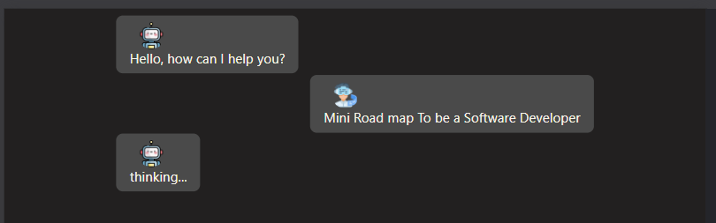

# WEB LLM Chat Application

This project is a **React-based Chat Application** powered by the **@mlc-ai/web-llm** library. It allows users to interact with a language model (LLM) in real-time, providing a conversational interface with a clean and responsive UI.
 
## Table of Contents

- [Features](#features)
- [Project Structure](#project-structure)
- [Getting Started](#getting-started)
  - [Prerequisites](#prerequisites)
  - [Installation](#installation)
  - [Running the Application](#running-the-application)
- [How It Works](#how-it-works)
- [Styling](#styling)
- [Configuration](#configuration)
- [Dependencies](#dependencies)
- [Contributing](#contributing)
- [License](#license)

---

## Features

- **Real-time Chat**: Users can send messages and receive responses from the LLM.
- **Dynamic Thinking Indicator**: Displays a "thinking..." message while the model processes input.
- **Customizable UI**: Styled using CSS and SCSS for a modern and responsive design.
- **Model Selection**: Uses the `Llama-3.1-8B-Instruct-q4f32_1-MLC` model by default.
- **Keyboard Support**: Press "Enter" to send messages.
- **Avatar Support**: Includes user and assistant avatars for a visually appealing chat interface.

---

## Project Structure

```
WEB LLM/
├── public/
│   ├── bot-avatar.png
│   ├── user-avatar.png
│   └── vite.svg
├── src/
│   ├── assets/
│   ├── App.jsx
│   ├── app.css
│   ├── app.scss
│   ├── index.css
│   └── main.jsx
├── .gitignore
├── eslint.config.js
├── index.html
├── package.json
├── README.md
└── vite.config.js
```

### Key Files

- **`src/App.jsx`**: Main React component that handles the chat interface and LLM integration.
- **`src/app.css`**: Contains the primary styles for the application.
- **`src/main.jsx`**: Entry point for the React application.
- **`vite.config.js`**: Configuration for the Vite build tool.
- **`public/`**: Contains static assets like avatars and icons.

---

## Getting Started

### Prerequisites

Ensure you have the following installed:

- **Node.js** (v16 or higher)
- **npm** (v8 or higher)

### Installation

1. Clone the repository:
   ```bash
   git clone https://github.com/your-username/web-llm.git
   cd web-llm
   ```

2. Install dependencies:
   ```bash
   npm install
   ```

### Running the Application

- **Development Mode**:
  ```bash
  npm run dev
  ```
  Open [http://localhost:5173](http://localhost:5173) in your browser.

- **Build for Production**:
  ```bash
  npm run build
  ```

- **Preview Production Build**:
  ```bash
  npm run preview
  ```

---

## How It Works

1. **Model Initialization**:
   - The application initializes the LLM engine using the `@mlc-ai/web-llm` library.
   - The selected model (`Llama-3.1-8B-Instruct-q4f32_1-MLC`) is downloaded and loaded into memory.

2. **Message Handling**:
   - User messages are added to the `messages` state.
   - The LLM processes the messages and generates a response, which is appended to the chat.

3. **Thinking Indicator**:
   - While the LLM processes input, a "thinking..." message is displayed to enhance user experience.

4. **Dynamic UI**:
   - Messages are displayed with appropriate roles (`user` or `assistant`) and avatars.

---

## Styling

The application uses a combination of **CSS** and **SCSS** for styling:

- **`src/app.css`**: Defines the layout and styles for the chat interface.
- **`src/app.scss`**: Provides additional SCSS features for nested styling.

### Key Styles

- **Chat Area**:
  - `.Conv-Area`: Main container for the chat interface.
  - `.messages`: Displays the chat messages.
  - `.message`: Styles individual messages with role-specific classes (`user`, `assistant`).

- **User Input**:
  - `.user-Area`: Contains the input field and send button.
  - `input`: Styled for a clean and modern look.
  - `button`: Customizable send button.

---

## Configuration

### Model Selection

The model is selected in the `useEffect` hook in `App.jsx`:

```jsx
const selectModel = "Llama-3.1-8B-Instruct-q4f32_1-MLC";
```

You can replace this with another model supported by the `@mlc-ai/web-llm` library.

### ESLint Configuration

The project uses a custom ESLint configuration defined in eslint.config.js. It includes rules for React, hooks, and general JavaScript best practices.

---

## Dependencies

### Production Dependencies

- **[@mlc-ai/web-llm](https://www.npmjs.com/package/@mlc-ai/web-llm)**: Core library for interacting with the LLM.
- **[react](https://reactjs.org/)**: JavaScript library for building user interfaces.
- **[react-dom](https://reactjs.org/docs/react-dom.html)**: React package for DOM rendering.

### Development Dependencies

- **[vite](https://vitejs.dev/)**: Build tool for fast development.
- **[eslint](https://eslint.org/)**: Linter for JavaScript and JSX.
- **[@vitejs/plugin-react](https://github.com/vitejs/vite-plugin-react)**: Vite plugin for React.

---

## Contributing

Contributions are welcome! To contribute:

1. Fork the repository.
2. Create a new branch:
   ```bash
   git checkout -b feature-name
   ```
3. Make your changes and commit them:
   ```bash
   git commit -m "Add feature-name"
   ```
4. Push to your fork and submit a pull request.

---

## License

This project is licensed under the MIT License.

---

## Screenshots

### Chat Interface


### Thinking Indicator


---

## Acknowledgments

- **[MLC AI](https://mlc.ai/)**: For providing the `@mlc-ai/web-llm` library.
- **[Vite](https://vitejs.dev/)**: For the fast and efficient build tool.
- **React Community**: For the amazing React ecosystem.
```